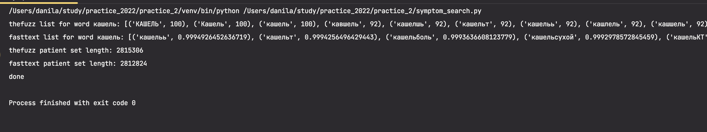

# Symptom Search
Этот скрипт предназачен для работы с данными о пациентах и их симптомах.
В скрипте реализованы 2 реализации функций - с помощью библиотеки thefuzz
для нечеткого сравнения строк, использующей расстояние Левенштейна (индекс от 0 до 100) и нейронную модель
FastText из gensim. FastText была выбрана, так как лучше подходит для задачи
поиска опечаток, чем другие модели (Word2Vec)
## Работа с модулем
Главный скрипт - в файле symptom_search.py. Перед работой нужно
добавить файл data.csv (с симптомами) в папку с программой.
## Функции модуля
```
create_small_data - для создания файла с данными размером 1% от оригинального
сreate_words - для создания очищенного seta из данных, включен в репо (words.csv)
create_similarity_dictionary - создаёт словарь вида [{'слово': ['a', 'b']}, ...], нужен для создания модели fasttext
load_dictionaries - загружает все словари из папки dictionaries и возвращает массив словарей
create_model - создаёт модель fastText на основании словарей (модель есть в репо)
find_similar_words_thefuzz - возвращает маccив ближайших слов, используя thefuzz, limit - количество слов
find_similar_words_fasttext - возвращает маccив ближайших слов, используя модель fasttext, limit - количество слов
find_patients - дает массив номеров пациентов, у которых в симптомах есть искомое слово или похожие слова
find_patients_thefuzz - вызывает find_patients, similar_words берет из thefuzz
find_patients_fasttext - вызывает find_patients, similar_words берет из fasttext
test_similar_words - тестирует функции find_similar_words_thefuzz и find_similar_words_fasttext
test_similar_words - тестирует функции find_patients_thefuzz и find_patients_fasttext
main - модель и словари есть в репозитории, поэтому их создание закомментировано
```
## Пример работы
